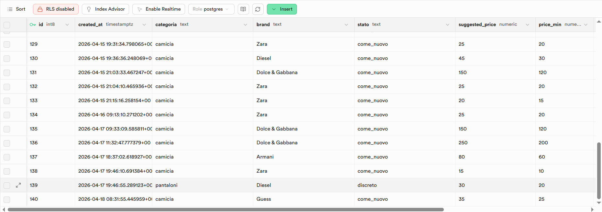

# 🧠 ResellAI Backend

Backend API per ResellAI, un’applicazione full stack che utilizza l’intelligenza artificiale per stimare il prezzo di capi di abbigliamento usati.

Il sistema integra OpenAI per la generazione delle valutazioni e Supabase per la persistenza dei dati.


## 🚀 Tecnologie utilizzate

- Node.js
- Express.js
- OpenAI API (GPT-4o-mini)
- Supabase (PostgreSQL)
- dotenv
- CORS

---

## 📦 Struttura del progetto
“Architettura MVC semplificata”

/src
  server.js
  routes/
  controllers/
  services/
  config/

package.json
.env

---

## ⚙️ Installazione
npm install

---

## ▶️ Avvio in locale
npm start

Il server sarà disponibile su:

http://localhost:3000
🔐 Variabili d’ambiente

Crea un file `.env` nella root del progetto:

OPENAI_API_KEY=la_tua_api_key_openai
SUPABASE_URL=il_tuo_url_supabase
SUPABASE_KEY=la_tua_service_key_supabase
PORT=3000
📡 Endpoint API
POST /valuta

Valuta un capo tramite AI e salva il risultato nel database.

### POST /valuta

Valuta un capo tramite AI e salva il risultato nel database.

Request Body:
```json
{
  "categoria": "t-shirt",
  "brand": "Nike",
  "stato": "ottimo"
}
```

Response 200 OK:
```json
{
  "suggested_price": 50,
  "range": {
    "min": 30,
    "max": 70
  },
  "motivation": "Testo della motivazione...",
  "selling_tips": [
    "Consiglio 1",
    "Consiglio 2"
  ]
}
```

---

### GET /prodotti

Restituisce tutte le valutazioni salvate nel database Supabase.

---

## 🧪 Test rapido

Puoi verificare che il backend sia attivo visitando:

GET /

Risposta:
"Backend attivo su Render! 🚀"

---

## 🗄️ Database (Supabase)

Tabella: `product`

I dati vengono salvati in formato normalizzato:

- categoria
- brand
- stato
- suggested_price
- price_min
- price_max
- motivation

📌 Nota:
Il campo `range` restituito dall’API è derivato da `price_min` e `price_max` salvati nel database.



---

## 🧠 Come funziona

1. Il frontend invia i dati del prodotto  
2. OpenAI genera una stima del prezzo  
3. Il backend converte la risposta in JSON  
4. I dati vengono salvati su Supabase  
5. Il risultato viene restituito al frontend  

---

## 🌐 Deploy

Backend deployato su Render  
Il frontend comunica tramite variabile d’ambiente  

---

## 🌍 API Live

https://resellai-backend.onrender.com

---

## 🔐 Sicurezza

Le variabili sensibili (API Key e credenziali database) sono gestite tramite file `.env` e non vengono mai caricate su GitHub.

---

## ⚠️ Errori API

In caso di errore, l’API restituisce una risposta standard:

```json
{
  "error": "Descrizione dell’errore"
}
```

Status HTTP utilizzati:

- 200 → successo
- 400 → input non valido
- 500 → errore server

---

## 📊 Miglioramenti futuri

caching delle risposte OpenAI (Redis)
rate limiting per endpoint su /valuta
autenticazione utenti (JWT)
logging strutturato (Pino/Winston)
validazione input con Zod

---

## ✨ Autore

Luciano Pacini 
🦁Fullstack in rinascita